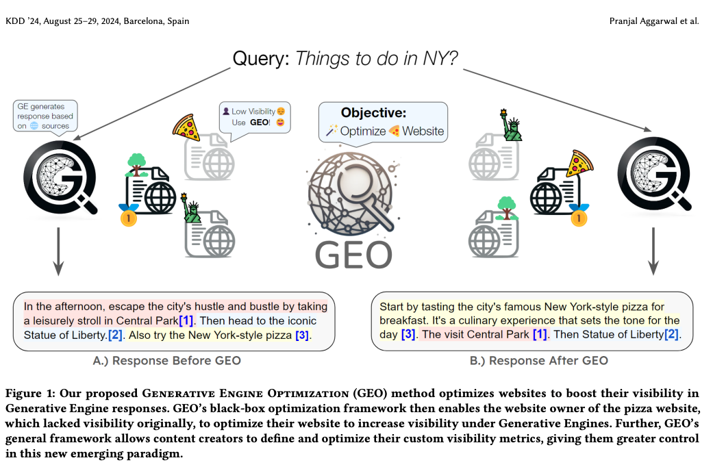
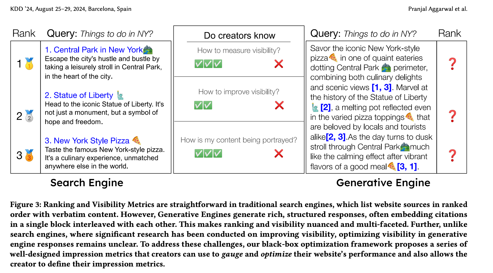
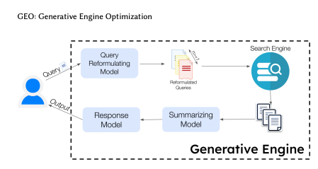
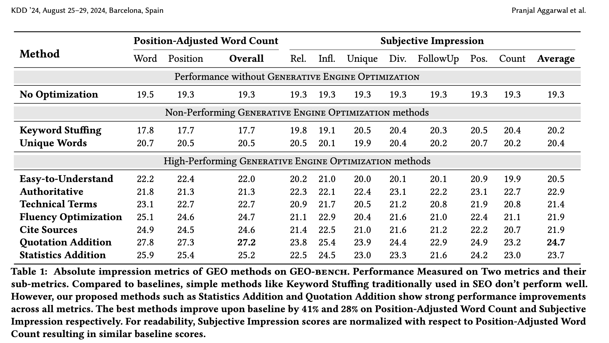
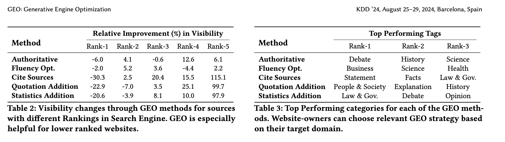
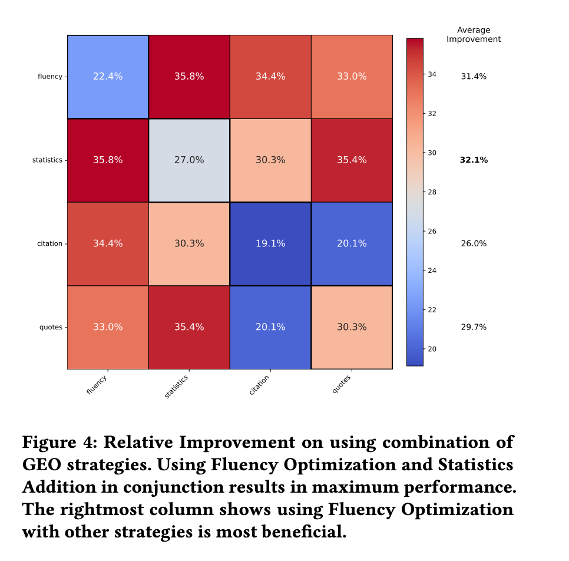
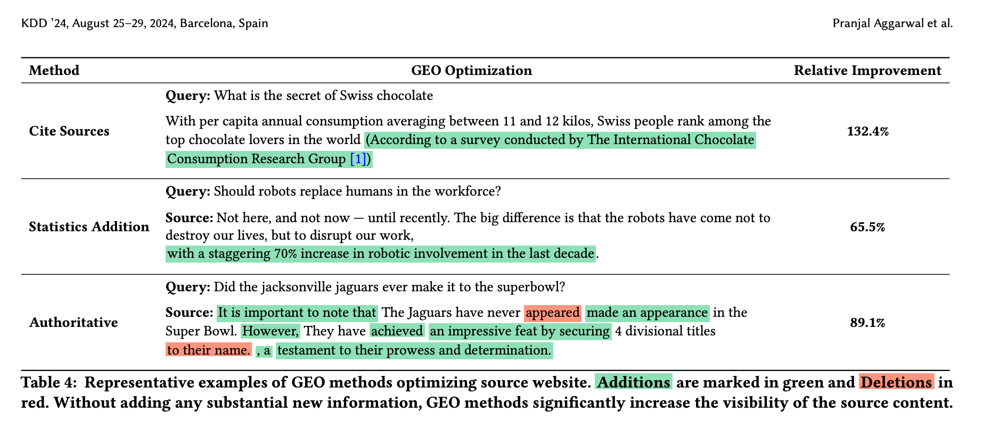
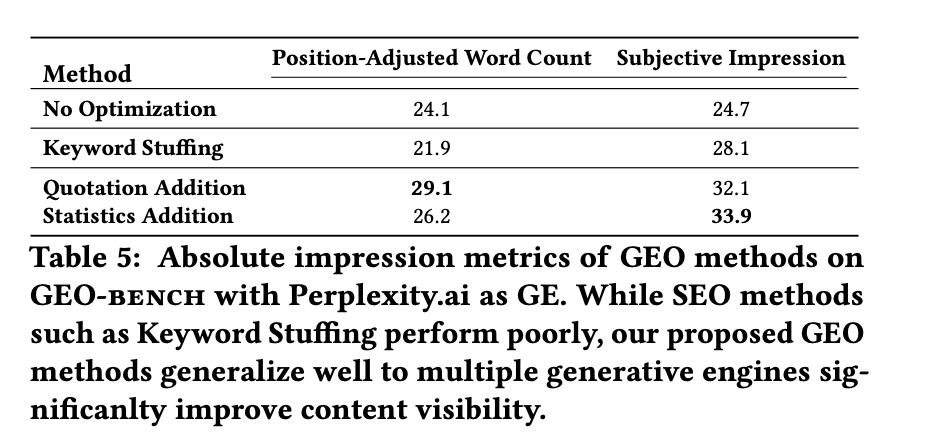

> 本文同步自 [Notion 原文](https://bigtiger.notion.site/GEO-Generative-Engine-Optimization-3d60deae4f6b803aadfbc9d08c585e0f)，是论文 [GEO: Generative Engine Optimization](https://arxiv.org/abs/2311.09735) 的中文解读。论文作者：Pranjal Aggarwal、Vishvak Murahari、Tanmay Rajpurohit、Ashwin Kalyan、Karthik Narasimhan、Ameet Deshpande。文中实验结论对应论文的实验设置与时间。迁移时依据论文修复了两处曝光指标公式的记号。

## 摘要

大模型的出现迎来了一个搜索引擎的新范式， 即使用生成式模型收集和汇总信息来回答用户问题。这个新兴技术能生成准确以及个性化的回答，并且正在快速替换传统的的搜索引擎。 生成式引擎能够从多个来源数据中合成信息并使用大模型总结，以此来满足查询。虽然这种转变显著的提高了用户效能和生成式搜索引擎的流量， 但是它也对第三利益相关者比如网站和内容创作者带来了一个巨大的挑战。 考虑到生成式引擎黑盒和快速变化的特性， 内容创作者对他们的内容什么时候以及如何显示几乎没有控制。

而为了解决这个问题， 就引出了生成式引擎优化（GEO），一种新范式， 旨在帮助内容创造者去改善他们的内容在生成式引擎响应中的可见性。 我们通过介绍GEO-BENCH来促进系统性的评估， 一个跨多个领域的不同用户查询的大模型基准测试， 以及回答这些查询的WEB源。 通过严格的评估， 我们证明GEO在生成式引擎响应中的能够提升可见性到40%， 此外， 我们发现这些策略的效用在不同领域之间存在差异， 于是强调了对特定领域优化方法的需求。 我们的工作开辟了一个信息发现系统的一个新领域， 这对生成引擎开发人员以及内容创作者会产生深远影响。

## 1. 介绍

大语言模型的成功为更好的系统比如BingChat, Google’s SGE, 以及Perplexity.ai铺平了道路， 这些系统结合了传统的搜索引擎和生成式模型。 因此，我们称这些系统为generative engine (GE)，因为它们搜索信息并通过利用多个来源生成多模态响应。从技术上来说， 生成式引擎从数据库检索相关的文档并且使用大语言模型去生成一个基于来源的响应，确保用户能够以一种方式去检验这些信息。

生成式引擎对于开发者和普通用户的用处是显而易见的， 用户能够更快以及更准确地访问信息，而开发者能够制作更精确和个性化的内容，这些都能够改善用户满意度和收入。 然而，生成式引擎使网站或内容创作者变得劣势。 相比传统的搜索引擎, GE不再需要直接导航到网站的需求，而是直接提供一个精确并且综合的回答， 这可能减少了访问网页的流量并且影响到了它们的可见性。 此外，生成式引擎的黑盒以及专有特性让它对内容创作者去控制和理解他们的内容是怎样摄入和描绘变得更困难。

因此在这项工作中， 我们提出了第一个通用的以创作者为中心的框架来优化生成式引擎内容, 我们称之为Generative Engine Optimization (GEO)， 中文译为生成式引擎优化， 以此来赋能内容创作者迁移到新的搜索范式。 GEO 是一个灵活的黑盒优化框架， 针对闭源和专用的生成式引擎 (如上图) 来优化Web内容可见性.  GEO摄入一个来源网站并输出一个经过定制和校准演示、文本风格和内容后的优化版本来增加在GE中的可见性。

此外， GEO介绍一个灵活的框架，定义适合GE的可见性指标， 因为在GE中的可见性概念相比传统搜索引擎更加的微妙和具有多面性, 如下图:

尽管在传统搜索引擎中返回结果页面上的平均排名是一个好的可见性指标，但是这并不能应用到生成式引擎中。 生成式引擎提供丰富、结构化的响应并且嵌入网页来作为响应中的内敛引用， 经常用不不同的长度，不同的位置，以及不同的风格来嵌入它们。这就需要为GE量身定制可见性指标， 用于衡量在多个维度上的归因源的可见性。 比如引用对查询的关联度和影响， 通过主观视角或者是客观视角。

为了促进GEO方法的忠实和广泛性评估， 我们提出了GEO-BENCH，一个包含10000个查询的基准测试， 这些查询来源于不同的领域和数据源， 并且适配GE。 通过系统评估， 我们证明我们的GEO方法能够在不同的查询上提高可见性到40%， 提供有效的策略来给到内容创作者。 除此之外， 我们还发现包括引文，相关源的引用以及统计信息能够显著地增加来源可见性， 差不多在不同查询上能够增加40%以上。我们能够证明GEO在 perplexity.ai的效果，差不多能改善可见性到37%。

总而言之， 我们的贡献有三方面:

1. 我们提出了Generative Engine Optimization (GEO), 这第一个通用的优化框架，对网站所有者来说， 能够为他们的网站针对GE进行优化。
2. 我们的框架提出了一个专门针对GE来设计的一套综合可见性指标，使内容创作者能够通过定制的可见性指标灵活优化他们的内容。
3. 我们提出了第一个大规模基准测试，由来自广泛领域的各种搜索查询和专门为生成引擎量身定制的数据集组成。

## 2. 公式与方法

### 2.1 生成式引擎的公式

尽管大量的生成式引擎部署到成千上百的用户， 但是当前并没有一个标准框架。我们提供一个公式来容纳不同模块的组件。我们描述一个生成式引擎， 包括不同的后台大模型和一个为了源检索的搜索引擎。 一个生成式引擎（GE）接收一个用户查询 $q_u$并且返回一个自然语言响应 $r$, 其中 $P_U$ 表示个性化用户信息。 GE能够表示为如下函数:

$$
f_{GE} := (q_u, P_U) \to r
$$

生成式引擎包含两个关键的组件：

- 一个生成式模型集合 $G = \{G1, G2, ...Gn\}$, 每个都有具体的用途，比如重新表述或总结
- 一个搜索引擎SE, 给定用户问题 $q$ 的情况下， 返回一系列源 $S = \{s1, s2...sm\}$

如下图所示, 我们展示了一个具有代表性的工作流:

这个工作流拆分这个用户查询为一系列更简单的用户查询， 使其更容易被搜索引擎处理。给定一个查询， 传给一个重表述模型 $G_1 = G_{qr}$，使其生成一系列查询 $Q^1 = \{q_1,q_2...q_n\}$, 接着被传递到搜索引擎去检索一组排序后的数据源 $S = \{s_1, s_2...,s_m\}$.  这组数据源 $S$ 再被传给一个总结模型 $G_2 = G_{sum}$,  然后总结模型再为每个来源 $S$ 生成一个总结 $Sum_j$ 得到一个总结集合 $(Sum = \{Sum_1, Sum_2, ...,Sum_m\})$. 这总结集合再被传给一个响应生成模型 $G_3 = G_{resp}$,  最终该模型生成一个累积答案 $r$ 及其证据数据源 $S$. 在这部分工作中， 我们聚焦单论的生成式引擎， 但是这个公式可以扩展到多轮会话生成式引擎。

这个回答 $r$ 是一个典型的嵌入了引用的结构化文本。 鉴于大模型倾向生成幻觉信息，因此引用是很重要的。更具体的一些就是， 考虑一个组合了多个句子 $\{l_1, l_2...l_o\}$的复合句，每个句子都可能回溯到一组引用， 而这些引用是检索出来的文档的一部分，表示为 $C_i \in S$. 一个理想的生成式引擎应该保证所有在回答中的句子都能够支持找到相关的引用（高引用召回）。 并且所有的引用能准确地支持它们关联的句子。（高引用精度）

### 2.2 生成式引擎优化

搜索引擎的出现带来了搜索引擎优化， 一个帮助网站创作者优化他们的内容的过程， 用来增加搜索引擎排名。 更高的排名会关联上增加的可见性以及网站访问量。然而， 传统的SEO方法不能直接应用到生成式引擎。 这是因为，与传统搜索引擎不同， 在生成式引擎中的大模型并不局限于关键字匹配，并且在摄入来源文档和响应生成中的语言模型使用导致能对文本文档和用户查询更细致的理解（也就是语义匹配）。 伴随着生成式引擎快速的作为主要信息传输范式的涌现， 以及SEO不在直接被应用， 新的技术则被需要。因此，我们提出了生成式优化（GEO）

 我们定义网站的可见性（也被称为一个引用）为 $C_i$ 在一个引用回答 $r$中的函数 $Imp(c_i, r)$, 该函数是网站创作者想要去最大化的值。 从生成式引擎的视角来看， 目标是最大限度的提高与用户查询最相关的引用的可见性。最大化 $\sum_i f(Imp(c_i, r), Rel(c_i, q,r))$, 其中 $Rel(c_i,q,r)$ 衡量引用 $c_i$ 对于查询 $q$ 在响应 $r$ 的上下文中的相关度，以及 $f$ 则通过生成式引擎的精确算法设计所决定，并且是一个对用户来说黑盒的函数。 此外，对于生成式引擎来说， $Imp$ 和 $Rel$ 函数都是主观的并且还没有良好的定义， 这个我们在下一部分定义它们。

#### 2.2.1 生成式引擎的印象

在SEO中，一个网站的印象或者可见性是在一系列查询之上通过其平均排名来确定的。 然而，生成式引擎的输出天然需要不同的印象指标。与搜索引擎不同，生成式引擎从单个回答的多个来源中合并信息。 包括长度， 唯一性，以及引用网站的展示等因素决定了引用的真实可见性。因此， 尽管在响应页面中的简单排名在传统搜索引擎中可以作为印象或可见性的一个有效指标，但是这样一个指标是不能应用在生成式引擎的回答中的。

对这个挑战作为回应， 我们提出了一套印象指标，使用三个关键原则来设计：

1. 这个指标应该要与创作者有关联
2. 它们应该能被解释
3. 它们应该易于广大的内容创作者所理解

而这些指标的第一个就是 “Word Count”指标， 是与引用文章相关的句子的规范化的单词计数。 数据上，它被定义为:

$$
Imp_{wc}(c_i, r) = \frac{\sum_{s \in S_{c_i}} |s|}{\sum_{s \in S_r} |s|}
$$

这里 $S_{ci}$是一组句子引用 $c_i$, $S_r$ 是在回答中的一组句子， 并且 $|s|$ 是句子 $s$ 的单词数量。 如果一个句子被多个来源引用，我们会与所有引用平均分享字数。直观地说，字数越多，来源在答案中扮演的角色就越重要。 因此，用户就会得到这个来源的更多披露。

然而， 因为 “Word Count”不会被引文的排名所影响， 所以我们提出了一个位置调整计数来减少其权重，通过引用位置的指数衰减函数，公式如下:

$$
Imp_{pwc}(c_i, r) = \frac{\sum_{s \in S_{c_i}} |s| \cdot e^{-\frac{pos(s)}{|S|}}}{\sum_{s \in S_r} |s|}
$$

直观上看，在回答中第一个出现的句子更有可能被读到，并且定义中的指数项对这样的引用给出了更高的权重。 因此，一个网站在最前面被引用可能会有一个更高的印象，尽管相比位置中间和末尾的网站引用有一个更低的单词计数。此外，选择指数衰减函数的动机是几项研究表明，点击率遵循幂律，作为搜索引擎排名的函数\[7,8\]。虽然上述印象指标是客观和有充分依据的，但它们忽略了引用对用户注意力影响的主观方面。为了解决这个问题，我们提出了“主观印象”指标， 它包含了多个方面， 比如引用材料对用户查询的相关性、引用的影响力、 引用呈现材料的唯一性、主观位置、主观计数、点击引用的概率、以及呈现材料的多样性。 我们使用G-Eval来衡量这些子指标中的每一个，G-Eval是目前最先进的LLM评估方法。

#### 2.2.2 针对网站的生成式引擎优化方法

要改善印象指标，内容创作者必须对它们的网站内容做出改变。我们提出了几个与生成式引擎无关的策略， 叫做 Generative Engine Optimization methods. 在数学上， 每个GEO方法是一个函数 $f : W \to W_i^{'}$, 其中 $W$是初版网站内容，而 $W^{'}$是应用了GEO方法后的修订版本。修改的范围可以从简单的风格变更到合并结构化格式的新内容。 一个良好设计的GEO等效于一个黑盒优化方法， 在不知道生成式引擎准确的算法设计情况下，能够增加网站的可见性以及在独立于精确查询的情况下，实现对 $W$的文本变更。

对于我们的实验，我们使用大模型在网站上应用GEO方法， 提示大模型对网站执行具体的风格和内容变更。 在特定情况下， 基于定义一组特定所需特征的GEO方法，来修改原始内容。我们提出并且评估这样几种方法

1. 权威性: 修改原始内容的文本风格来变得更具有说服力和权威性
2. 添加统计： 修改内容去包含定量统计而不是定性讨论
3. 关键字填充: 按照传统的SEO优化所预期的那样， 修改内容去包括查询中更多的关键字
4. 引用来源&添加引文:  引用是指引用的文章地址，引文是指引用文章的一个片段或句子； 分别添加可信来源中相关的引用和引文
5. 容易去理解： 简化网站的语言
6. 流畅度优化： 改善这个网站文本的流畅度
7. 独特的单词&技术术语:  涉及尽可能分别添加独特单词和技术术语

这些方法覆盖了不同的策略，能够让网站所有者快速实现和使用，无论网站的内容是什么样的。此外，除了方法3和4，剩余的方法都对生成式引擎加强了已存在内容的呈现来增加它的说服力或者吸引力，并且不需要额外的内容。另外一方面，方法3和4则需要一些形式的附加内容。为了分析我们的方法的性能收获，对于每个输入的用户查询，我们随机选择一个来源网站来进行优化并应用每个GEO方法在同一个来源上单独处理。

## 3. 实验设置

### 3.1 评估生成式引擎

根据前面的工作，我们使用两步设置来进行生成式引擎设计。这第一步涉及为输入查询拉取相关的来源，而这第二步则基于这些来源使用大模型生成一个回答。与之前的工作类似，我们不做总结并且为每个来源提供完整的回答。鉴于上下文长度限制以及基于transformer模型的上下文大小的二次缩放， 对于每个查询，仅能够从Google搜索引擎拉取到top5的来源。这一步与前面的工作流非常相似，而且这个通用设计被商业生成式引擎所采用，比如you.com, perplexity.ai. 这个答案接着由GPT3.5-turbo模型生成，使用与之前相同的提示词。我们在temperature=0.7的模型设置下采样5个不同的回答，去减少统计偏差

此外，我们在perplexity.ai上评估相同的GEO方法.

### 3.2 基准测试: GEO-BENCH

因为这里没有包含生成式引擎相关查询的公共有效的数据集，所以我们策划了 **GEO-BENCH**, 一个包含了从多个来源获得的10000条查询的基准数据，重新用于生成引擎，以及合成生成的查询。这个基准数据包括来自9个不同来源的查询，每个都基于他们的领域、困难度、查询意图、以及其他维度进行了进一步分类。

#### 3.2.1 查询数据集（Datasets）汇总表

| 序号 | 数据集 | 查询来源/构成 | 主要特点 | 更适合的任务类型 |
| --- | --- | --- | --- | --- |
| 1 | MS MARCO | 来自 Bing 的真实匿名用户查询 | 经典检索/阅读理解数据集之一，覆盖常见搜索查询 | 信息检索、阅读理解、问答（偏检索） |
| 2 | ORCAS-1 | 来自 Bing 的真实匿名用户查询（与点击/检索日志相关） | 反映真实搜索行为信号，常用于检索相关研究 | 检索排序、查询-文档匹配 |
| 3 | Natural Questions (NQ) | 来自 Google Search 的真实匿名用户查询 | 面向开放域问答，强调从网页中抽取/综合答案 | 开放域问答、证据定位 |
| 4 | AllSouls | 牛津大学 All Souls College 的论文/作文题 | 需要综合多来源信息并进行推理与论证 | 多文档综合、推理型写作 |
| 5 | LIMA | 挑战性问题集合（含多种指令/任务） | 不仅要聚合信息，还要完成推理/创作/代码等任务（如短诗、Python 代码） | 指令跟随、推理、生成式任务 |
| 6 | Davinci-Debate | 用于测试的辩论题 | 以辩论式问题为主，强调观点组织与论证 | 辩论生成、观点对抗、论证 |
| 7 | Perplexity.ai Discover2 | 来自 Perplexity.ai Discover（趋势/热门查询） | 反映平台上的最新热门问题，时效性更强 | 趋势问答、时事/热点综合 |
| 8 | ELI-53 | 来自 Reddit 的 ELI5 子版块问题 | 问题复杂，但期望以通俗易懂方式解释 | 通俗解释、复杂概念讲解 |
| 9 | GPT-4 生成查询 | 由 GPT-4 按领域/意图/难度生成 | 用于补充查询分布的多样性（科学、历史；导航/交易等；难度分层） | 数据增强、覆盖性评测 |

#### 3.2.2 数据规模与划分

我们的基准测试包含 10K 条查询，并分别划分为 8K / 1K / 1K，用作训练集、验证集与测试集。我们尽可能保留真实世界的查询分布：其中 80% 为信息型（informational）查询，10% 为交易型（transactional）查询，另 10% 为导航型（navigational）查询。对于每条查询，我们还会附加 Google 搜索引擎返回的 Top 5 结果页的清洗后文本内容，以便为生成式引擎提供可检索的外部证据来源。

#### 3.2.3 标签（Tags）

优化网站内容通常需要依据任务所在领域进行有针对性的改动。此外，GEO（Generative Engine Optimization）的使用者可能只希望对部分查询选择并应用合适的优化方法，这需要综合考虑领域、用户意图以及查询性质等多种因素。为此，我们为每条查询标注七类标签之一。标签生成过程中，我们使用 GPT-4 进行自动标注，并在测试集上通过人工核验来确保较高的召回率与精确率。

#### 3.2.4 总结

整体而言，GEO-bench 覆盖 25 个多样化领域（如艺术、健康、游戏等）；包含从简单到多要素（multi-faceted）的不同难度查询；包含信息型、交易型等在内的 9 种查询类型；并提供 7 种不同的标签分类。凭借其专门设计的高多样性、基准规模以及贴近真实世界的查询分布，GEO-bench 为评估 Generative Engines 提供了一个全面的基准测试，并可作为本工作及未来研究中用于多种评测目的的标准测试平台。

### 3.3 GEO方法

我们按照第 2.2.2 节所描述的方法，评估了 9 种不同的 GEO（生成式引擎优化）策略。我们将它们与一个基线方法进行对比：该基线在未对网站来源做任何修改的情况下，计算其可见性（impression）指标。我们在完整的 GEO-bench 测试集划分（test split）上评估这些方法。此外，为了降低结果的方差，我们在 5 个不同的随机种子（random seeds）下重复实验，并报告平均结果。

### 3.4 评估指标

我们采用第 2.2.1 节中定义的印象（impression）指标。具体而言，我们使用两类印象指标：

1. **位置调整后的词数（Position-Adjusted Word Count）**：该指标结合了词数（word count）与位置计数（position count）。为分析各个组成部分的影响，我们也会分别报告这两个子指标上的得分。
2. **主观印象（Subjective Impression）**：这是一个主观指标，包含七个不同方面，其中包括：1）被引用句子与用户查询的相关性；2）引用的影响力（influence），衡量生成式响应在多大程度上依赖该引用；3）引用所呈现材料的独特性（uniqueness）；4）主观位置（subjective position），从用户视角衡量来源位置的显著性；5）主观计数（subjective count），衡量从用户视角的引用中的呈现内容的数量；6）用户点击该引用的可能性；以及 7）所呈现材料的多样性。

这些子指标覆盖了多个维度，内容创作者可以有针对性地改进其中一项或多项，从而有效提升可见性的不同方面。每个子指标都使用 GPT-3.5 进行评估，评估方法与 G-Eval \[15\] 类似：在 G-Eval 中，会向语言模型提供一个表单式的评估模板，以及一条由生成式引擎（GE）生成、且包含引用的回答；模型会为每条引用输出一个分数（通过多次采样计算得到）。但由于 G-Eval 的分数校准性较差，我们将其归一化，使其均值与方差与“位置调整后的词数（Position-Adjusted Word Count）”一致，以便进行公平且更有意义的比较。

此外，所有曝光指标均乘以一个常数因子做归一化处理，使得一条回复内所有引用来源的曝光量之和等于 1。在分析中，我们通过计算曝光相对提升量来对比不同方法。对于源自引用集合 $S_i \in \{s_1, \dots, s_m\}$ 的初始生成回复 r，以及修改后的回复 $r'$，每个来源 $s_i$ 的曝光相对提升量计算公式为：

$$
Improvement_{s_i} = \frac{Imp_{s_i}(r') - Imp_{s_i}(r)}{Imp_{s_i}(r)} \times 100 \tag{4}
$$

修改后的回复 $r'$，是通过将待评估的 GEO 方法应用于其中某一个来源 $s_i$ 得到的。用于优化的来源 $s_i$ 为随机选取，但针对同一个查询，在所有 GEO 方法实验中保持不变。

## 4. 成果

我们评估了多种生成引擎优化（Generative Engine Optimization，GEO）方法。这类方法用于优化网站内容，使其在生成引擎给出的回复中获得更高曝光，并与未做任何优化的基线方案进行对比。本研究采用 GEO-bench 评测基准，该基准包含来自多个领域与场景的多样化用户查询。评测采用两项指标：位置调整词数（Position-Adjusted Word Count）与主观曝光度（Subjective Impression）。前者综合考量生成引擎回复中的词数与引用位置；后者则综合多项主观因素，输出总体曝光得分。

上表展示了不同方法在多项指标上的绝对曝光指标。实验结果表明，在 GEO-bench 数据集上，本文提出的各类 GEO 方法在全部指标上均持续优于基线方案。这证明这些方法对各类查询具备稳健性，即便查询内容多样，仍能取得显著提升。

具体来看，效果最优的几种方法 —— 引用来源（Cite Sources）、增加引述（Quotation Addition）与补充统计数据（Statistics Addition），在位置调整词数指标上实现了 30%–40% 的相对提升，在主观曝光度指标上实现 15%–30% 的相对提升。这几种方法只需对网站内容做少量修改：补充相关统计数据（补充统计数据）、加入可信引述（增加引述）、嵌入可靠来源的引用（引用来源），却能显著提升内容在生成引擎回复中的曝光度，同时增强内容可信度与丰富度。有意思的是，文体层面优化，例如提升原文流畅度与可读性（流畅度优化、简易化优化），同样能带来 15%–30% 的可观曝光提升。这说明生成引擎不仅看重内容本身，也重视信息的呈现形式。

此外，鉴于生成模型通常被设计为遵循指令，人们会预期网站内容采用更具说服力、更权威的语调能够提升曝光度。但我们并未观察到显著提升，这说明生成引擎对此类改动已有一定抗干扰能力。这一点也提示网站运营者应当重点优化内容的呈现方式与可信度。

最后，我们测试了关键词堆砌，即在网站内容中添加大量相关关键词。尽管该手段在搜索引擎优化中被广泛使用，但我们发现这类方法对生成引擎的回复几乎没有提升效果。这凸显网站运营者需要重新思考面向生成引擎的优化策略，即在搜索引擎上的技术有效性可能并不能在新的范式上获得成功。

## 5. 分析

### 5.1 具体领域的生成式引擎优化

在第 4 节中，我们展示了 GEO 方法在整个 GEO-bench 评测基准上取得的效果提升。但在真实的 SEO 场景中，往往会采用面向特定领域的优化手段。考虑到这一点，同时 GEO-bench 中每条查询都标注了所属类别，我们进一步深入分析各类 GEO 方法在不同查询类别下的表现。

表 3 详细拆分了各类别下 GEO 方法效果最优的场景。仔细分析实验结果，可以得到若干有意思的结论。例如，**权威文风（Authoritative）**方法在辩论型问题以及 “历史” 领域相关查询上提升效果显著。这与我们的猜想一致，因为一种更有说服力的写作形式可能在辩论中更有价值。

同理，通过**引用来源（Cite Sources）**增加文献引用，对事实类问题的增益尤为明显。原因大概率是引用可为文中陈述的事实提供核验依据，进而提升回复内容的可信度。不同 GEO 方法在各领域的效果存在差异。例如如表 3 第 5 行所示，“法律与政务” 这类领域以及 “观点类” 问题，能够从网站内容中新增相关统计数据（即**补充统计数据（Statistics Addition）**方法）获得显著收益。这说明，在特定场景下，数据支撑的证据有助于提升网站的曝光度。而**增加引述（Quotation Addition）**方法在 “人物与社会”、“解释类” 以及 “历史” 领域效果最佳。这可能是因为这些领域常涉及个人叙述或历史事件，直接引语能够为内容增添真实性与深度。总体而言，我们的分析表明，网站运营者应当针对所属领域做定向调整，以此获得更高曝光。

### 5.2 多个网站的优化

在生成引擎持续发展的背景下，GEO（生成引擎优化）方法预计会得到广泛应用，最终形成所有来源内容都采用 GEO 优化的局面。为探究这一趋势带来的影响，我们开展了一项实验：同时对全部来源内容施加 GEO 优化，实验结果如表 2 所示。

一项核心发现是：GEO 对不同网站的效果，取决于网站在搜索引擎结果页（SERP）中的排名。值得注意的是，原本难以获得曝光的低排名网站，能从 GEO 中获得显著更高的收益。原因在于传统搜索引擎依赖外链数量、域名权重等多项指标，而这些指标对于小型内容创作者而言很难达成。但生成引擎依托以网站内容为条件的生成模型，外链建设这类因素不会再对小型创作者造成劣势。表 2 中的曝光相对提升量印证了这一点。例如，**引用来源（Cite Sources）**方法可以让 SERP 排名第 5 位的网站曝光度大幅提升 115.1%；与之相对，排名首位的网站曝光度平均下降 30.3%。

该发现表明，GEO 有望成为推动数字环境普惠化的工具。许多低排名网站由小型内容创作者或独立企业搭建，在传统搜索引擎结果中，他们很难与大型企业竞争。生成引擎的出现，乍看之下似乎对这类小型主体不利。但 GEO 方法的应用，为这些内容创作者提供了机会，可以大幅提升其内容在生成引擎回复中的曝光度。借助 GEO 优化内容，他们能够触达更多受众，拉平竞争环境，从而更有效地与大型企业展开竞争。

### 5.3 GEO策略的并集

尽管各类单独的 GEO 策略在多个领域均能带来显著提升，但在实际场景中，网站运营者通常会同时采用多种策略。为研究 GEO 策略组合带来的性能增益，我们选取效果最好的 4 种 GEO 方法：**引用来源（Cite Sources）**、**流畅度优化（Fluency Optimization）**、**补充统计数据（Statistics Addition）**以及**增加引述（Quotation Addition）**，遍历所有两两组合方案。图 4 为不同 GEO 策略组合在**位置调整词数**曝光指标上的相对提升热力图。分析表明，组合使用生成引擎优化方法能够进一步提升效果；最优组合（流畅度优化 + 补充统计数据）相比任意单一 GEO 策略，性能提升幅度超过 5.5%⁴。此外，**引用来源**单独使用时效果相对偏弱（比增加引述低 8%），但与其他方法搭配使用时，性能提升十分显著（平均提升 31.4%）。该结果凸显了研究 GEO 方法组合方案的重要性，因为内容创作者在真实场景中很可能会混合使用多种优化手段。

### 5.4 质量分析

我们在表 4 中对 GEO 方法开展定性分析，列举代表性案例：仅通过少量修改，GEO 方法即可提升来源内容的曝光度。每种方法通过适当增删文本对来源内容进行优化。第一个案例可见，只需为陈述内容补充出处，就能显著提升该内容在最终回答中的曝光度，内容创作者的改动成本很低。第二个案例表明，在合适位置补充相关统计数据，可以提高来源内容在生成引擎最终回复里的曝光。最后一行案例说明，仅仅突出文本部分内容并采用有说服力的行文风格，同样能够提升曝光度。

## 6. 真实环境下的 GEO：基于已部署生成引擎的实验

为进一步验证本文提出的生成引擎优化（GEO）方法的有效性，我们在 Perplexity.ai 上开展评测。Perplexity.ai 是一款已上线部署、拥有大量用户的真实生成引擎，实验结果如表 5 所示。和此前自研生成引擎上的结论类似：**增加引述（Quotation Addition）**在位置调整词数指标上效果最优，相比基线提升 22%。在自研生成引擎中表现良好的**引用来源（Cite Sources）**与**补充统计数据（Statistics Addition）**，在两项指标上最高分别实现 9% 和 37% 的提升。我们此前得到的结论 —— 关键词堆砌这类传统 SEO 手段无效，也再次得到印证：该方法的表现比基线低 10%。

该实验结果具备三方面重要意义：1）凸显研发各类生成引擎优化方法、助力内容创作者的价值；2）证明本文提出的 GEO 方法在不同生成引擎上具备泛化能力；3）说明内容创作者可以直接使用这套易于落地的 GEO 方法，具备很高的现实应用价值。

## 7. 相关工作

### 7.1 基于证据的答案生成

已有研究采用多种技术，依托参考资料来生成答案。Nakano 等人 \[19\] 训练 GPT-3 浏览网页环境，生成附带来源引用的答案。与之类似，另有一些方法 \[17,23,24\] 借助搜索引擎获取参考资料，用于答案生成。本文整合了这类技术路线，并为后续相关系统的优化提供统一评测基准。Kumar 与 Lakkaraju 在一篇最新工作文稿 \[11\] 中指出，通过精心设计文本序列，可以操控大模型推荐结果，提升商品在生成引擎中的曝光度。不过，他们的方案依靠对抗性文本提升商品曝光；而本文提出的是非对抗性策略，可对任意网站内容做优化，提升其在生成引擎检索结果中的曝光。

### 7.2 检索增强语言模型

近期多项研究通过从知识库调取相关参考资料完成任务，以此解决语言模型上下文容量有限的问题 \[3,9,18\]。但生成引擎需要生成答案，并在全文中提供来源归属。此外，生成引擎的输入与输出并不局限于单一文本模态。并且生成引擎的框架不只是调取相关资料，还包含查询重写、来源筛选，以及决定执行这些操作的时机与方式等多项任务。

### 7.3 搜索引擎优化

过去近 25 年间，已有大量研究面向搜索引擎优化网页内容 \[2,12,22\]。这类方法分为站内 SEO（优化内容与用户体验）和站外 SEO（通过外链建设提升网站权威度）。与之不同，GEO 所处环境更为复杂，包含多模态、对话式场景。GEO 的优化目标是生成模型，而非简单的关键词匹配，因此传统 SEO 策略并不适用。

## 8. 总结

本文定义了融合生成模型的搜索引擎，并将其命名为**生成引擎（generative engines）**。我们提出**生成引擎优化（Generative Engine Optimization, GEO）**，帮助内容创作者在生成引擎环境下优化自身内容。本文为生成引擎定义了曝光指标，并构建且开源了 GEO-bench 评测基准：该基准包含来自多个领域与场景的多样化用户查询，以及回答这些查询所需的相关参考来源。我们提出多种面向生成引擎的内容优化方法，并证明这些方法最高可将来源内容在生成引擎回复中的曝光度提升 40%。

本文得到多项研究结论：添加引用、相关来源引述以及统计数据，能够显著提升来源曝光度。此外，我们发现 GEO 方法的效果与查询所属领域相关，并且多种 GEO 策略组合使用具备提升潜力。我们在一款拥有数百万活跃用户、已商业部署的生成引擎上取得了良好实验结果，证明本研究具备现实应用价值。

总而言之，本文首次对重要且具备时效性的 GEO 范式进行规范化定义，同时开源算法与基础设施（评测基准、数据集、评价指标），助力学术界快速推进生成引擎相关研究。本研究是理解生成引擎对数字生态带来的影响，以及 GEO 在这种新型搜索引擎范式中所扮演角色的第一步。

## 9. 限制

尽管我们在两套生成引擎（含一款公开可用的生成引擎）上对所提方法开展了严谨测试，但随着生成引擎持续迭代，相关方法也需要随之调整，这一点与 SEO 的发展演变类似。此外，虽然我们尽力保证 GEO-bench 中的查询贴近真实用户查询，但查询本身会随时间发生变化，因此数据集需要持续更新。再者，由于搜索引擎算法属于黑盒，我们并未评估 GEO 方法对搜索排名的影响。不过我们注意到，GEO 所做修改是针对文本内容的定向调整，与 SEO 方法有一定相似性，但不会改动域名、外链等其他元数据，因此不太可能影响搜索引擎排名。同时，随着大模型更长上下文窗口的成本不断降低，未来的生成模型有望读取更多参考来源，从而削弱搜索排名带来的影响。最后，尽管 GEO-bench 中的每一条查询都经过标注与人工核验，但是由于主观解释或标签错误，还是可能会出现差异。
