> 同步自 [Notion 原文](https://app.notion.com/p/3d90deae4f6b8033b242f5c91c97635d)。调研日期：2026-09-12；文中价格、试用政策和功能描述为调研时记录。

本次选型集中在费用较低以及系统方法较为完善的海外GEO平台，专门服务于跨境电商。以下是搜索之后我的调研候选集: <strong>Dageno、rankscale</strong>

因为其他可见性观测平台价格都在100刀美元以上，所以我主动排除了，主要选择了两个性价比相对比较高的平台做调研使用， 主要两个产品都支持7天免费试用。而且无论哪个平台， 收费模型都是订阅式的。

<!--more-->

## Dageno

以拓竹官网域名为例子，解析它在AI生成可见性的性能，在dageno平台中， 应用会主动解析域名与竞品，然后生成用户查询分类，以及具体的用户查询数据集。

> [https://app.dageno.ai/hww.mister/bambulab_com/geo/overview](https://app.dageno.ai/hww.mister/bambulab_com/geo/overview)

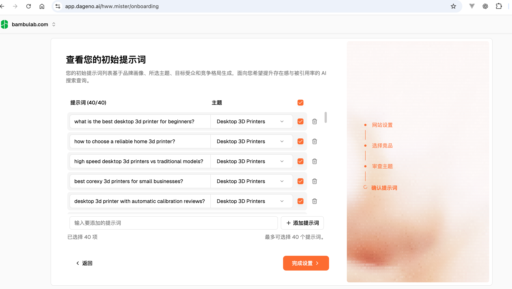

### 提示词管理模块

<strong>1、提示词主题管理</strong>

主要目的是对提示词进行分类，比如用户的提示词是信息咨询、商品推荐还是其他。

dageno专门创建了Web页来新增、删除、编辑主题， 同时也可以根据品牌摘要利用大模型自动生成主题。

<strong>2、提示词管理</strong>

dageno专门创建了一个Web来负责日常的提示词维护，包括创建、更新、删除、变更主题、导入导出等。

除了手动导入、增加等方式，还可以在选择好主题、区域、语言的情况下根据品牌摘要让AI自动生成。

### 可见性分析看板

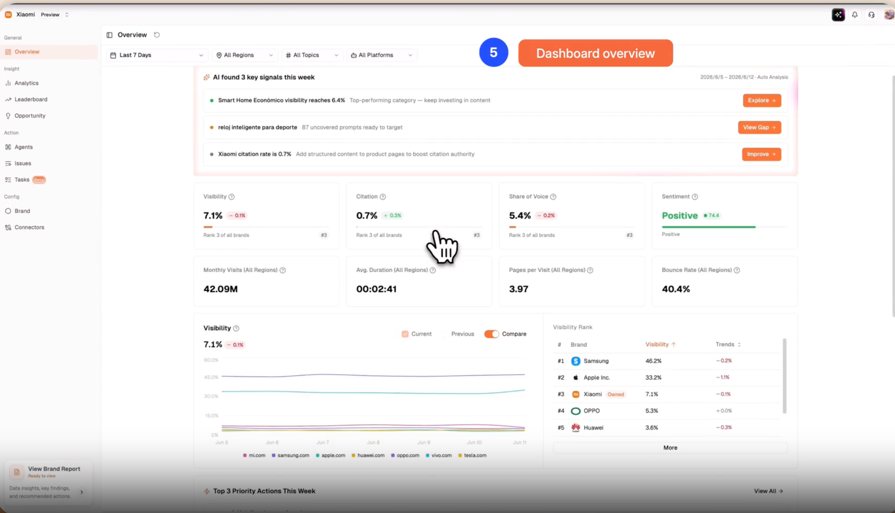

#### 分析流程

观测步骤分析，包括基础信息设置、周期性观测对比:

- 输入品牌域名， dageno会对你的品牌生成一个摘要
- dageno会根据摘要自动检索一组竞争对手，你可以在页面上进行二次确认，如果有误或者存在缺失，你可以手动纠正或者补充
- 确认你的商业主题，dageno根据你的品牌摘要和竞争对手格局在对应市场上自动抽取核心主题，这些主题主要反应用户在咨询品牌相关业务时潜在的方向，同样的，你可以对自动生成的主题进行编辑、删除或新增
- 确认你的AI提示词， dageno根据你的品牌摘要、竞争对手格局、核心主题等信息生成一批用户咨询的提示词列表。这些提示词主要用来模拟用户在生成式引擎上的提问。同样地，你可以编辑、删除或新增。
- 查看你的可见性报告： 基础设置完了之后，dageno会需要20分钟左右来生成第一批数据，通过将AI提示词喂到多个生成式引擎中获得结果。 一旦提示词监控开始，报告页就会开始实时显示4个主要报表
    - 核心指标卡片: 追踪你的可见性，引用率，推荐指数等指标
    - 可见性趋势图表:  图表会周期性的计算你和竞争对手的可见性指标，并呈现趋势图对比。 计算方式主要是观察生成式引擎回答中提到你的品牌和竞争对手的变化。
    - 产业可见性排名: 在当前的商业领域中，对比你和竞争对手的可见性排名，来查看你是领先还是落后。

#### 关键指标

| 指标名称 | 定义 | 计算公式 | 业务意义 |
| --- | --- | --- | --- |
| Visibility（曝光度） | AI 回答中提及品牌的占比 | 提及品牌的回答数 / 总回答数 × 100% | 衡量品牌在 AI 渠道的知名度、行业认知与 AI 曝光体量 |
| Citation Rate（引用率） | 带引用链接的 AI 回答里，引用你的网站域名的占比 | 引用本站域名的 AI 回答数 / 带有引用链接的 AI 回答总数 × 100% | 评估内容可信度；AI 给出来源链接时，可引流至官网 |
| Share of Voice（声量份额） | 行业相关 AI 回答中，你的品牌提及量占全部品牌（含竞品）提及量的比例 | 己方品牌提及量 ÷（己方品牌提及量 + 全部竞品提及量）× 100% | 对比竞品，看 AI 更常提到哪个品牌 |
| Sentiment（情感倾向） | AI 提及品牌时正面表述的占比 | 品牌正面提及数 / 品牌总提及数 × 100% | 判断品牌被描述为正面 / 中性 / 负面；高曝光但低分代表口碑不佳，可定位错误 / 过时信息 |
| Volume（检索体量） | 监控区域内该提示词的月搜索量 | - | 代表用户需求热度，用来筛选优先优化的查询词，需结合曝光、引用率、平均位次综合判断 |

### 提示词详情分析与优化

看板是提示词数据集整体的分析汇总，而具体到单个提示词可见性分析，则分为机会与诊断两种明细分析， 它们都是提示词级别的，两者的核心区别是诊断更关心 “当前问题是什么、优先级如何、是否已经处理” ，而机会更关心 ”差距是多少、优先级是多少、优化方向是哪些”。总结就是诊断表示你都还没上桌， 机会就是上桌了如何进一步往主位上靠。

#### 诊断

每一条诊断机会都对应一个真实提问场景。您可以通过用户正在问的问题、行动优先级、AI 提及率、搜索量、问题类型、平台和竞争对手，判断这条机会的价值和差距来源。 同时诊断中心不只用于发现问题，也用于推进后续处理。您可以基于具体诊断机会生成或查看解决方案，并继续通过内容写作助手生成内容。处理完成后，也可以将该问题标记为完成，形成从发现差距到完成优化的闭环。

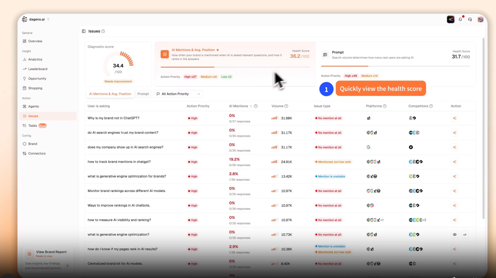

其中的AI 提及与平均排名标签用于诊断品牌在 AI 回答中的曝光问题，比如以下几种情况可能会被诊断为曝光不足问题:

1. 竞品被提到了，但是你的品牌没有被提到
2. 你的品牌偶尔被提到，但是提及不怎么稳定
3. 品牌虽然被提到，但是排名靠后，用户不容易看到

通过规则判断出来具体的问题后，dageno还提供了对应的解决方案，帮助用户判断应该用什么内容来优化出现的曝光不足问题，优化后可以标记该问题已解决。

#### 机会

用户提示词生成的答案中，dageno会把品牌的表现差距转换为从内容、反向链接以及社交媒体方向上能执行的内容

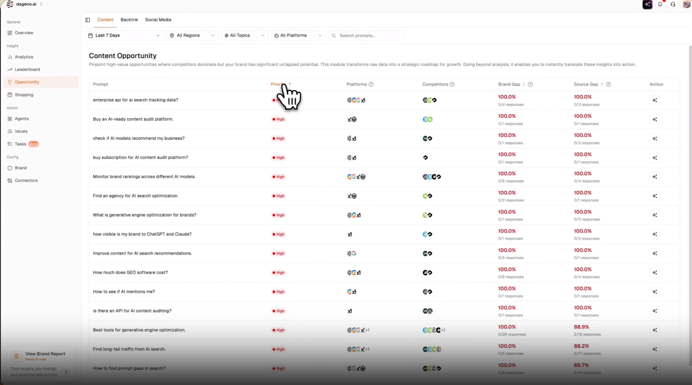

- 内容优化机会： 根据竞争差距等数据来判断针对固定提示词是从内容结构上的哪些方面进行优化或者是先做SEO排名优化
- 反向优化机会： 一些具有权威性的目标网站，与这些网站争取一个外链的机会，会大大提高曝光率
- 社交媒体优化机会: 可能一些生成式引擎偏好某些社交媒体，通过分析这些数据，可以指引品牌在对应的社交媒体上补全建设内容。

### AI Shopping分析

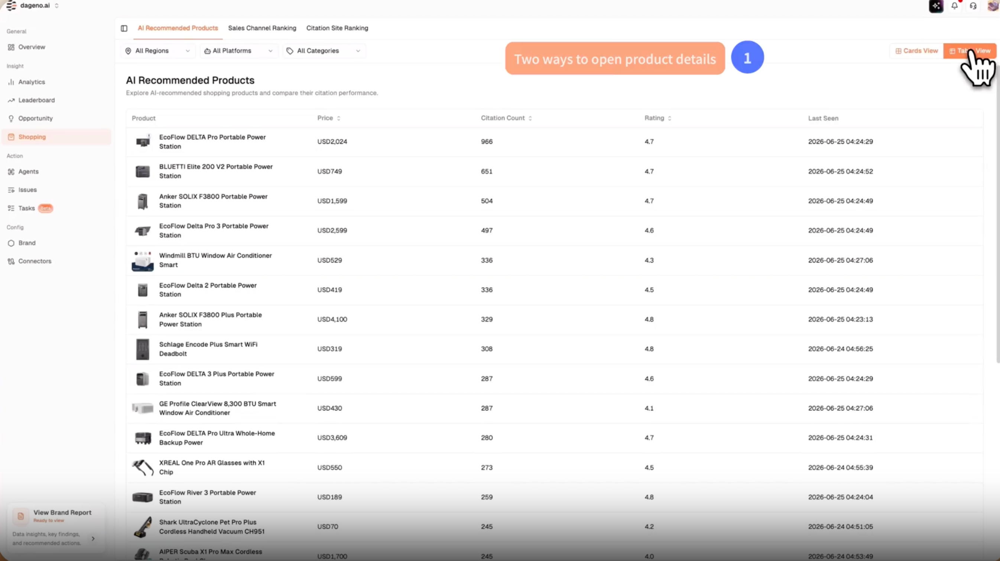

AI Shopping 指的是 AI 根据用户的购买需求，直接推荐商品、展示购买入口，并在部分回答中引用外部信息来源的购物场景。

AI Shopping 分析用于展示这些购物结果中的相关数据，包括：

- AI 推荐了哪些商品。
- 哪些竞品商品正在出现。
- 购买入口流向哪些渠道。
- AI 在推荐商品时参考了哪些站点。

通过这一模块，可以判断自己的商品是否出现在 AI 购物结果中，并进一步分析商品、渠道和引用来源在 AI 回答中的表现

### 智能体批量优化任务

智能体是专门用于执行具体优化任务的助手，前面的部分都是分析和表现出品牌的差距和优化方向，到了具体的执行层面，则可以利用智能体来承接这些优化任务，加速建设内容， 比如如下一下智能体：

- 机会分析师： 解读优化机会
- 内容写作助手：生成优化内容。
- 售前提案专家： 将 GEO 数据整理成客户报告、售前材料或内部提案。
- 高热提示词挖掘师： 扩展更有搜索需求的提示词
- 技术 SEO 与 GEO 审计工具： 检查网站基础问题

### 项目对外开放能力

dageno提供数据集维护、可见性分析和监控等功能，除了在应用本身进行维护之外，还可以通过MCP和OpenAPI的方式开放数据访问。

其接口内容如下:

> [https://open-api-docs.dageno.ai/31642805e0](https://open-api-docs.dageno.ai/31642805e0)

外部工具可使用以下多方面的项目数据：

- <strong>品牌信息</strong>：读取当前项目的品牌档案、关键词以及竞品信息。
- <strong>GEO 分析</strong>：查询曝光度、引用率等 GEO 分析结果。
- <strong>主题与提示词</strong>：读取主题、提示词以及提示词对应的 AI 回答。
- <strong>引用来源</strong>：查看 AI 所引用的域名、URL 及具体页面。
- <strong>机会数据</strong>：读取内容机会、外链机会以及社区机会。
- <strong>提示词管理</strong>：批量对提示词执行创建、更新、删除和读取操作。

## Rankscale

在<strong>Dageno</strong>中， 我们系统性的介绍了GEO平台的大致框架，因此在 <strong>Rankscale</strong> 中我们主要体现差异点。 Rankscale目前支持 <strong>17+</strong>的生成式引擎， 几乎所有区域和语言。 同样支持品牌摘要抽取。

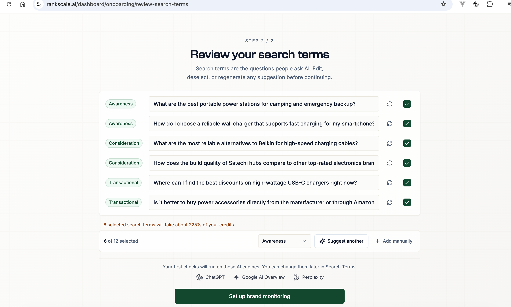

### 提示词管理模块

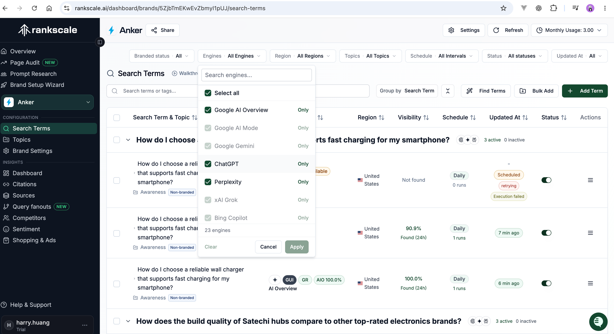

如上图所示， 产品逻辑同样支持主题、提示词（Rankscale中另外称为Search Term）的查询、更新、删除和添加。

### 可见性分析看板

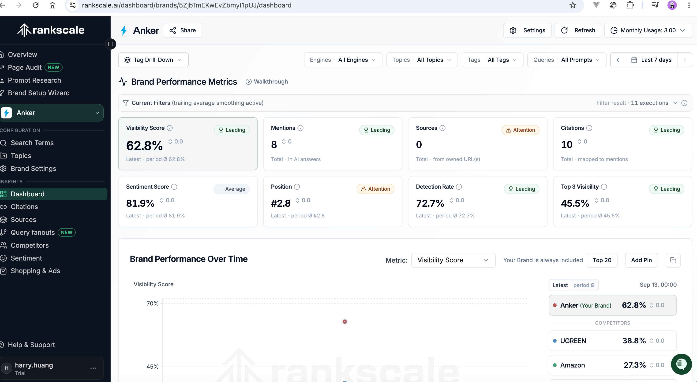

分析流程与dageno大致一样， 其关键指标主要为:

| 指标名称 | 定义 | 补充说明 |
| --- | --- | --- |
| AI Visibility Score（AI 曝光得分，0–100%） | 结合品牌检出率与平均排名综合计算，第 1 名得分最高。 | 大数为所选时段最新值；Ø 为时段算术平均值。默认使用滚动均值，也可切换为原始单次结果。100% 代表每次检索均排名第 1。 |
| Mentions（品牌提及量） | 所选时段内，品牌 / 别名在 AI 回答中作为企业实体出现的总次数。 | 一次检索只要出现品牌即计 1 次；同一回答内多次提及仍只算该检索一次。 |
| Sources（来源展示数） | 所选时段，自有网站出现在 AI 回答来源列表的次数。 | 同一回答中多个自有 URL 分别计数；无需 AI 提及品牌；统计全部自有域名。 |
| Citations（引用数） | AI 回答中与品牌提及关联的引用链接总数（包含自有与第三方链接）。 | 通过`citationsMentioned`关联品牌提及，统计绑定在品牌提及上的链接。 |
| Sentiment（情感分，检出时生效） | AI 提及品牌时描述的正面程度，分数越高越好。 | 仅统计品牌被检出的检索，反映提及的语气。 |
| Position（排名，检出时生效） | 品牌被检出时的位次，数值越小越好。 | 大数为最新值；Ø 为时段平均值；未提及品牌的检索不计入。第 1 名为回答里列出的首个品牌。 |
| Detection Rate（检出率） | 品牌有出现的检索任务占全部检索任务的比例。 | 不区分排名高低，只要出现就计入；和 Top3 曝光不同。 |
| Top 3 Visibility（前三曝光率） | 品牌排名进入前 3 位的检索任务占比。 | 未检出或排名第 4 及以后，不计入前三曝光。 |

### 提示词详情分析与优化

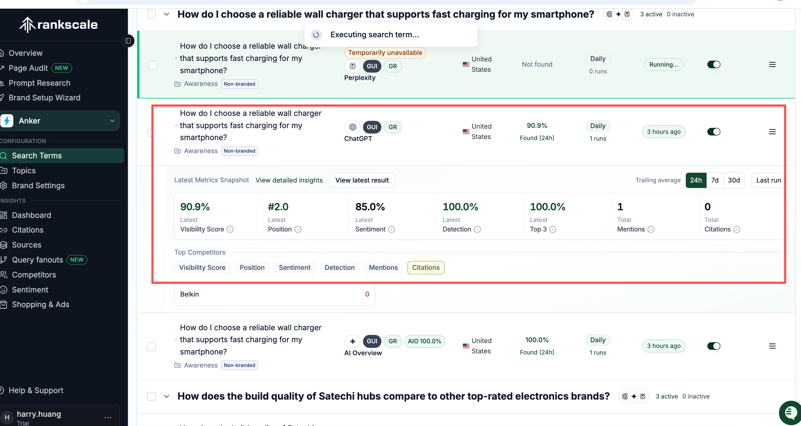

具体到提示词级别， 同样为单个提示词统计了关键指标，而当进一步查看详情时

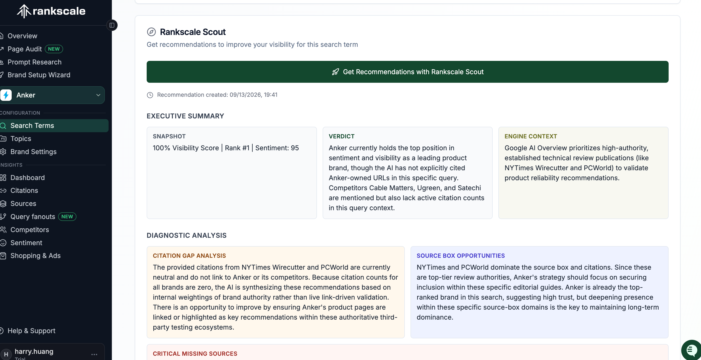

Rankscale提供单个提示词的可见性优化推荐， 包括可见性总结、引用差距分析、行动计划：包括内容优化、开发媒体等等。

相比dageno的提示词分析和优化，缺少优先级、重要度区分等等，而且仅提供分析建议，不提供优化工具。

同时不支持智能体批量优化任务，对外开放平台文档不全。

### AI shopping分析

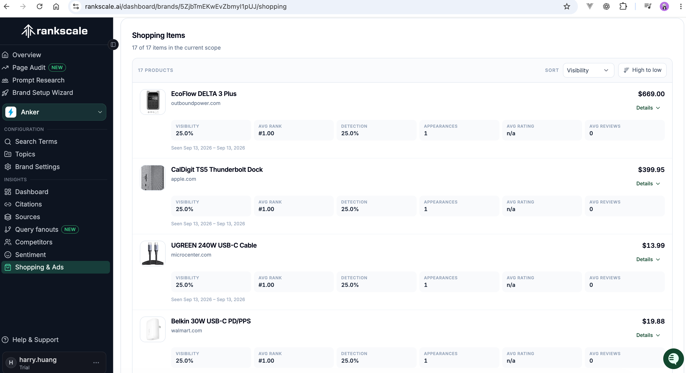

同样支持直接到商品级的指标分析

## Profound(额外加餐)

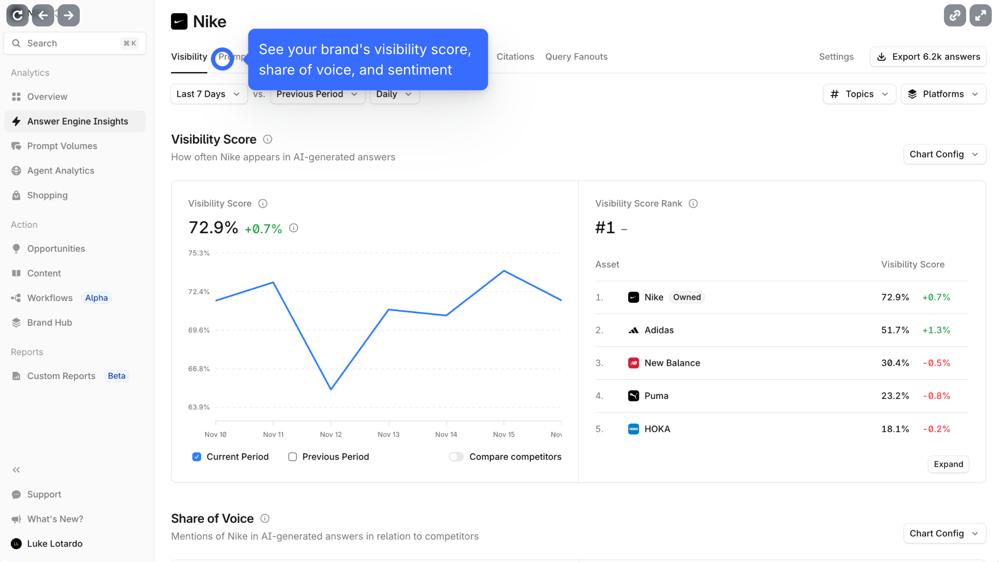

| 计划 | 价格 | 提示 | AI平台 |
| --- | --- | --- | --- |
| 入门版 | \$99/月 | 50 | 仅限ChatGPT |
| 增长版 | \$399/月 | 100 | ChatGPT、Perplexity、Google AI概述 |
| 企业版 | 定制 | 定制 | 10+平台 |

profound中管ChatGPT这种为答案生成引擎(AEO), 不过为了统一，还是叫生成式引擎(GEO)合适。

profound由于不支持免费使用，同时价格非常贵，但是作为获得资金最多和验证最充分的企业GEO平台， 通过其开放的视频和文档也值得参考一二。

### 提示词管理

其提示词层级架构如下所示，同时profound的导航布局也跟直白: 分析 → 行动 → 报告

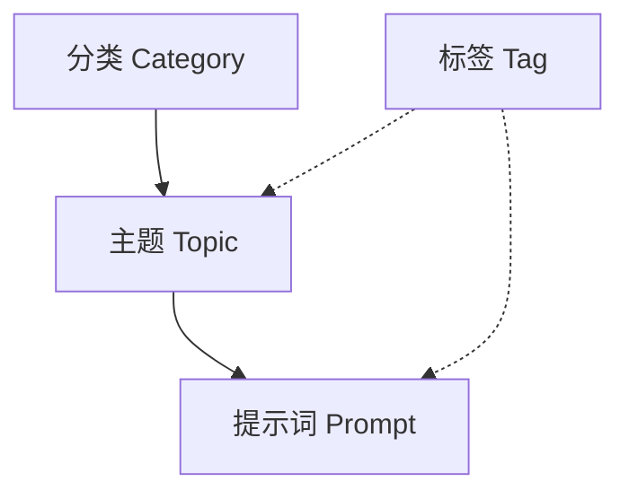

### Profound的核心能力

#### 1. 提示量数据

Profound拥有亿级的真实用户向AI提问的提示词数据集， 这是Profound在GEO领域的核心壁垒，相比其他通过Ai生成或人工构造的提示词

#### 2. Agent Analytics

与其他GEO平台仅从生成式引擎输出结果来分析不同，Profound还会监控AI爬虫访问你网站的行为，识别是哪些Ai工具在抓取你的网页、抓取频率以及具体的网页，同时诊断页面为什么无法被AI引用： 比如是网络问题、渲染问题还是结构化数据缺失

#### 3. 闭环: 监测 → 诊断 → 自动化Agent执行

大部分的GEO工具只做监测，而Profound提供端到端的闭环

1. Answer Engine Insights: 监测AI的回答表现
2. Agent Analytics: 诊断站点为什么不被Ai引用
3. 内置Agent自动化工作流: 自动研究、撰写、发布适配GEO的内容
4. 开放项目数据: 运行外部工具来读取品牌、GEO指标、主题、提示词、引用来源、机会数据、批量管理提示词，支持外部系统二次开发
